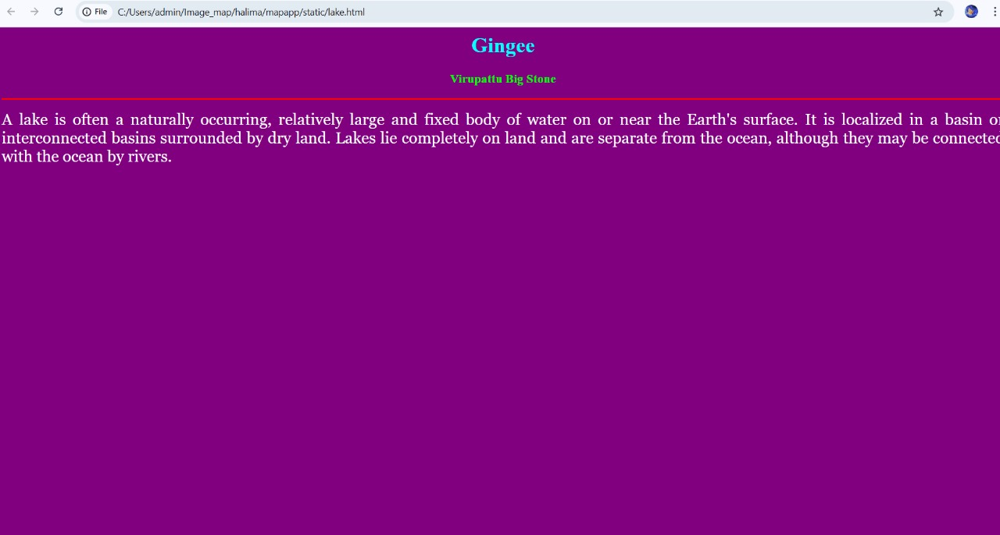

# Ex04 Places Around Me
# Date:24/04/2025
# AIM
To develop a website to display details about the places around my house.

# DESIGN STEPS
## STEP 1
Create a Django admin interface.

## STEP 2
Download your city map from Google.

## STEP 3
Using <map> tag name the map.

## STEP 4
Create clickable regions in the image using <area> tag.

## STEP 5
Write HTML programs for all the regions identified.

## STEP 6
Execute the programs and publish them.

# CODE

~~~
map.html
 
<html>
<head>
<title>My City</title>
</head>
<body>
<h1 align="center">
<b>Gingee</b>
</h1>
<h3 align="center">
<b>Halima A (24901005)</b>
</h3>

<map name="MyCity">
<area shape="react" coords="700,250,850,4s00" href="home.html" title="My Home Town">
<area shape="circle" coords="570,230,45" href="temple.html" title="Balamurugan Temple">
<area shape="circle" coords="640,200,30" href="lake.html" title="Anathur Lake">
<area shape="circle" coords="1120,360,25" href="garden.html" title="RR Garden">
<area shape="rect" coords="950,120,1100,140" href="stone.html" title="Virpattu Big Stone">
</map>

</body>
</html> 

home.html

<html>
<head>
<title>My Home Town</title>
</head>
<body bgcolor="cyan">
<h1 align="center">
<b>Gingee</b>
</h1>
<h3 align="center">
<b>Anathur - My Home Town</b>
</h3>

    Anathur is a Village in Thiruvennainallur Block in Villupuram 
    District of Tamil Nadu State, India. It is located 18 KM towards 
    South from District head quarters Viluppuram. 11 KM from 
    Thiruvennainallur.

</body>
</html>

garden.html

<html>
<head>
<title>My Home Town</title>
</head>
<body bgcolor="lime">
<h1 align="center">
<b>Gingee</b>
</h1>
<h3 align="center">
<b>RR Garden - The o2 Way</b>
</h3>

    A garden is a planned space, usually outdoors, set aside for the cultivation, display, and enjoyment of plants and other forms of nature. The single
    feature identifying even the wildest wild garden is control. The garden can incorporate both natural and artificial materials.Gardens often have 
    design features including statuary, follies, pergolas, trellises, stumperies, dry creek beds, and water features such as fountains, ponds (with or
    without fish), waterfalls or creeks. Some gardens are for ornamental purposes only, while others also produce food crops, sometimes in separate areas, 
    or sometimes intermixed with the ornamental plants. 

</body>
</html>
<html>
<head>
<title>My Home Town</title>
</head>
<body bgcolor="yellow">
<h1 align="center">
<b>Gingee</b>
</h1>
<h3 align="center">
<b>Virupattu Big Stone - The Tourists Attraction</b>
</h3>

    Stone Mountain's history traces back to before the time of European settlement, with local burial
    mounds dating back hundreds of years built by the ancestors of the historical Muskogee Creek nation 
    who first met the settlers in the early colonial period.The Treaty of Indian Springs in 1821 opened 
    a large swath of Georgia for settlement by non-Native Americans on former Creek Indian land, including 
    present-day Stone Mountain Village. In 1822, the area that now makes up the city was made a part of the 
    newly formed DeKalb County.

</body>
</html>

temple.html

<html>
<head>
<title>My Home Town</title>
</head>
<body bgcolor="pink">
<h1 align="center">
<b>Gingee</b>
</h1>
<h3 align="center">
<b>Shri Balamurugan Temple - Devotional center</b>
</h3>

    The temple's main deity is Lord Murugan, who is worshipped as the god of war.
    The temple architecture is a fine example of the Dravidian a tall gopuram (gateway tower) at the entrance.

</body>
</html>

~~~
# OUTPUT

# RESULT
The program for implementing image maps using HTML is executed successfully.
